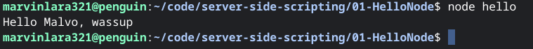
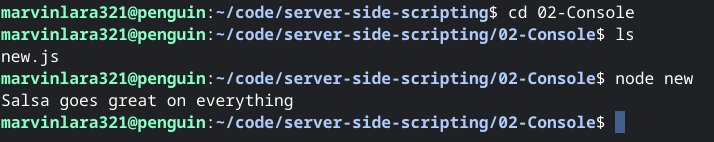

# server-side-scripting

*Developer: Marvin Lara
## Images
-First Exercise

-Second Exercise

-Third Exercise

## DIrections

**To install** |
---------------|
git clone https://github.com/Marvoro53/server-side-scripting.git
 
 [See here in Github](https://github.com/Marvoro53/server-side-scripting)
